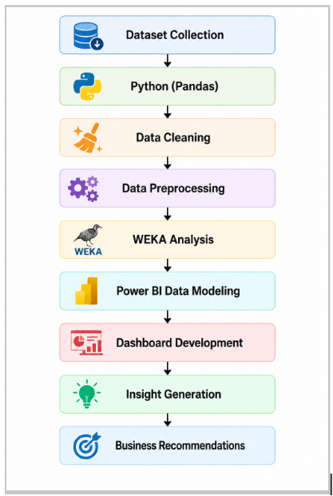

# 📱 Smartphone Usage & Addiction Analytics Dashboard

<p align="center">


</p>

---

## 📌 Project Overview

This project presents an **interactive Power BI dashboard** developed to analyze **smartphone usage patterns, social media behavior, addiction levels, mental health, sleep quality, and academic performance**.

The dashboard combines insights from **two datasets** and transforms raw data into meaningful visualizations using **Python (Pandas)**, **WEKA**, and **Microsoft Power BI**.

It enables users to explore trends through KPIs, interactive charts, slicers, filters, and business insights to better understand the relationship between smartphone usage and overall well-being.

---

# 🎯 Objectives

- Analyze smartphone usage behavior
- Study smartphone addiction levels
- Evaluate social media usage patterns
- Understand sleep and mental health trends
- Compare academic performance with smartphone habits
- Generate meaningful business insights
- Support data-driven decision making

---

# 🛠️ Tech Stack

- 🐍 Python
- 🐼 Pandas
- 📊 Matplotlib
- 🧠 WEKA
- 📈 Microsoft Power BI
- ⚡ DAX Measures
- 📑 Microsoft Excel

---

# 🔄 Project Workflow

<p align="center">

</p>

### Workflow

```
Dataset Collection
        ↓
Python (Pandas)
        ↓
Data Cleaning
        ↓
Data Preprocessing
        ↓
WEKA Analysis
        ↓
Power BI Data Modeling
        ↓
Dashboard Development
        ↓
Insight Generation
        ↓
Business Recommendations
```

---

# 🏠 Home Dashboard

<p align="center">

</p>

The Home Dashboard acts as the navigation page, allowing users to access each analytical dashboard through interactive navigation buttons.

---

# 📊 Executive Dashboard

<p align="center">

</p>

### Key KPIs

- Average Notifications
- Average Work & Study Hours
- Total Users
- Average Gaming Hours
- Average Screen Time
- Average Sleep Hours

### Visualizations

- Average Screen Time by Gender
- Addiction Level Distribution
- Screen Time vs Sleep
- Average Screen Time by Stress Level

---

# 📱 Smartphone Dashboard

<p align="center">

</p>

### Key KPIs

- Total Students
- Average Sleep Hours
- Average Social Support
- Average Mental Health Score
- Average Daily Usage
- Average Addiction Score

### Visualizations

- Most Used Social Media Platform
- Relationship Status Distribution
- Country-wise Student Distribution
- Average Daily Usage by Gender

---

# 💬 Social Media Dashboard

<p align="center">

</p>

### Visualizations

- Platform Popularity Distribution
- Platform Preference Across Academic Levels
- Daily Social Media Usage by Platform & Gender
- Average Addiction Score Gauge

---

# ❤️ Health Dashboard

<p align="center">

</p>

### Key KPIs

- High Addiction Students
- Poor Sleep Students
- Low Mental Health Students
- High Stress Users
- Average Sleep Hours
- Average Mental Health Score

### Visualizations

- Average Screen Time by Stress Level
- Mental Health Score by Academic Level
- Average Mental Health Score by Platform
- Average Screen Time by Addiction Level

---

# 📈 Summary Dashboard

<p align="center">

</p>

The Summary Dashboard highlights the most important findings from all dashboards and provides final recommendations for healthier smartphone usage.

---

# 📊 Key Insights

- 📱 Average smartphone usage is **4.92 hours/day**.
- 😴 Average sleep duration is **6.87 hours**.
- 🧠 Average mental health score is **6.23/10**.
- ⚠️ 70.77% of users fall into the addicted category.
- 📲 WhatsApp is the most frequently used social media platform.
- 📈 Higher stress levels are associated with increased screen time.
- 🎓 Graduate students show the highest mental health scores.
- 📉 High addiction levels are linked with reduced sleep quality.
- 🔔 Heavy notification frequency contributes to distraction and excessive phone usage.

---

# ⭐ Features

- 📊 Interactive Power BI Dashboard
- ⚡ DAX Measures
- 🎛 Dynamic KPIs
- 🎚 Interactive Slicers
- 🔄 Reset Filters Button
- 🏠 Home Navigation Button
- 📈 Business Insights
- 📱 Modern Dashboard UI
- 🎯 Responsive Layout
- 🌍 Geographic Analysis
- ❤️ Health Analytics
- 📚 Academic Performance Analysis

---

# 📁 Dataset

This project combines two public datasets:

### Dataset 1

**Smartphone Usage Dataset**

Contains:

- Screen Time
- Notifications
- Gaming Hours
- Sleep Hours
- Stress Level
- Addiction Level
- Work & Study Hours

### Dataset 2

**Students Social Media Addiction Dataset**

Contains:

- Mental Health Score
- Social Support
- Academic Performance
- Relationship Status
- Social Media Platform
- Daily Usage
- Sleep Hours

---

# 💡 Business Recommendations

- Encourage balanced smartphone usage.
- Reduce unnecessary notifications.
- Promote digital well-being awareness.
- Improve sleep habits through screen-time management.
- Encourage stress management programs.
- Increase awareness regarding smartphone addiction.
- Use dashboard insights for educational and research purposes.

---

# 🚀 Future Enhancements

- Publish dashboard to Power BI Service
- Add Machine Learning prediction models
- Real-time data integration
- Mobile-friendly dashboard
- AI-powered recommendation engine
- User authentication
- Cloud deployment

---

# 👨‍💻 Author

## **Ranjit Patra**

📧 LinkedIn

https://www.linkedin.com/in/ranjit-patra-b27816393

GitHub

https://github.com/Ranjitpatra26

---

## ⭐ If you found this project useful, consider giving it a Star!
